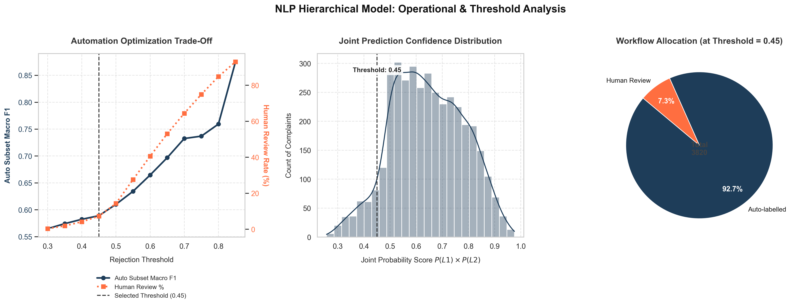

# Module Overview: Hierarchical Model Training & Evaluation

This module contains the model training and evaluation scripts for the two-level (Issue → Sub-issue) hierarchical classifier built on top of the TF-IDF artifacts produced by the vectorization module. Both scripts consume the same saved artifacts (`X_train_tfidf.npz`, `X_test_tfidf.npz`, `student_loan_augmented.csv`, `student_loan_test.csv`, `tfidf_vectorizer.pkl`) but represent two different stages of the experiment.

---

## 1. File Descriptions

### `hierarchical_baseline_experiment.py`
An exploratory experiment script that runs the full hierarchical pipeline with hyperparameter search and produces a set of diagnostic reports. It trains a Level 1 (Issue) classifier on the 4-class grouping defined by `get_issue_mapping()`, cascades the Level 1 probabilities into per-group Level 2 (Sub-issue) classifiers, and then separately tests an alternative 2-class Level 1 grouping for comparison. It also runs a threshold-based rejection analysis and prints full classification reports for every stage.

### `model_evaluation.py`
The operational evaluation script that builds a fixed, simplified version of the hierarchical pipeline using a 2-class Level 1 target derived directly from `Subissue_grouped`. It uses fixed hyperparameters (no grid search), introduces a joint Level 1 × Level 2 confidence score, sweeps the rejection threshold to study the automation/review trade-off, and generates a 3-panel visual dashboard summarizing the results.

---

## 2. Pipeline Logic & Methodology

### Two-Level Hierarchical Structure
Both scripts follow the same general shape: a Level 1 model predicts a broad group, its predicted probabilities are fed as additional features (via `hstack` with the TF-IDF matrix) into a separate Level 2 model trained only on the rows belonging to that group. Out-of-fold (OOF) Level 1 probabilities are computed via `cross_val_predict` for the training set so that the Level 2 models never see Level 1 probabilities that were produced by a model trained on the same rows. This is a critical design choice: using in-fold Level 1 predictions as Level 2 features would allow the cascade to exploit information that would not be available at inference time, producing overly optimistic Level 2 performance estimates and unreliable confidence scores in production.

### Level 1: Broad Issue Classification
* **`hierarchical_baseline_experiment.py`**: Level 1 target is `Issue_grouped`, a 4-class label set (`Loan Information & Servicing`, `Payment & Repayment Issues`, `Credit Reporting Issues`, `Loan Acquisition & Eligibility`) loaded directly from the training CSV. Both Logistic Regression and a calibrated `LinearSVC` are tuned via `GridSearchCV` over `C in [0.01, 0.1, 0.5, 1.0]`, using 5-fold stratified CV and `f1_macro` scoring.
* **`model_evaluation.py`**: Level 1 target is collapsed to a 2-class label (`Loan Servicing & Payments` vs `Non-Servicing Issues`) derived directly from `Subissue_grouped` via a local `GROUPING` dict, rather than using the 4-class `Issue_grouped` from the baseline. This simplification was driven by the baseline experiment's finding that the 4-class Level 1 boundary introduced confusion between semantically adjacent categories, compounding errors as they cascaded into Level 2. A 2-class broad split produces a cleaner decision boundary at Level 1, which in turn yields more reliable probability estimates to pass as cascade features  improving the overall joint confidence score used for routing. Fixed hyperparameters (`C=1.0`, no grid search) are used at this stage since the primary purpose of `model_evaluation.py` is to evaluate the finalised pipeline design rather than explore the hyperparameter space; the baseline experiment already established that `C=1.0` falls within the competitive range for this dataset.

### Soft-Vote Ensemble & Out-of-Fold Cascading
In both scripts, Level 1 predictions are produced by averaging the predicted probabilities of the Logistic Regression model and the calibrated `LinearSVC` ("soft voting"). Combining the two models exploits their complementary inductive biases: Logistic Regression provides well-calibrated posterior probabilities, while the LinearSVC  calibrated via Platt scaling  contributes stronger margin-based discrimination. The ensemble consistently outperforms either model in isolation on this dataset, particularly on minority classes where a single model's confidence can be systematically biased. The same averaging is applied to the OOF probabilities used as Level 2 input features.

### Level 2: Sub-issue Classification with Feature Cascading
For each Level 1 group, a separate Level 2 model is trained on `hstack([TF-IDF features, Level 1 probability features])`, with the target being `Subissue_grouped`. Appending the Level 1 probability vector to the TF-IDF features (feature cascading) allows Level 2 models to condition on the broad routing decision, which carries signal not fully captured by raw text features alone  for instance, a complaint predicted with high confidence as `Loan Servicing & Payments` at Level 1 is a priori more likely to resolve to `Payment & Repayment Issues` than to `Credit Reporting Issues`, and this prior is now explicitly encoded in the feature matrix. The two scripts differ in how they produce the per-group TF-IDF features: `hierarchical_baseline_experiment.py` re-vectorizes the raw text for each group via `tfidf.transform(cleaned_text)`, while `model_evaluation.py` slices the pre-computed `X_train` matrix directly (`X_train[mask]`).
* **`hierarchical_baseline_experiment.py`**: Uses `GridSearchCV` over `C in [0.1, 1.0, 5.0]` for both LR and the calibrated `LinearSVC`. Includes edge-case handling: groups with only one Sub-issue class are assigned that class directly with confidence 1.0 and no model is trained; groups where the smallest class has fewer than 2 samples skip the SVC entirely and use LR only.
* **`model_evaluation.py`**: Uses fixed `C=1.0` for both LR and `LinearSVC` for every group, with no grid search and no special-casing for single-class or very small groups. This is consistent with the operational focus of the script: the 2-class Level 1 grouping eliminates the degenerate per-group configurations that required special-casing in the baseline, and `C=1.0` was already validated as a competitive setting.

### Confidence Scoring & Rejection Threshold
* **`hierarchical_baseline_experiment.py`**: The routing confidence is the Level 2 model's own maximum predicted probability (`avg_sub_proba.max(axis=1)`). A single fixed `REJECTION_THRESHOLD = 0.45` is used to split predictions into "auto-labelled" and "sent for review."
* **`model_evaluation.py`**: The routing confidence is a joint score, `level1_confidence × max(P(Level 2))`. A prediction that is uncertain at Level 1 but confident at Level 2 or vice versa should not be trusted unconditionally; the joint product captures this: both stages must be confident for the overall prediction to be routed as automatic. Using only the Level 2 confidence (as in the baseline) can mask systematic Level 1 errors that compound silently downstream. This score is swept across thresholds from 0.30 to 0.85 in steps of 0.05 to map the full automation/review trade-off curve. The range was chosen to span from near-zero rejection (all complaints auto-labelled) to near-total rejection (only the most certain predictions pass), allowing the inflection point to be identified empirically. The chosen threshold of 0.45 was selected from this sweep as the point where the auto-labelled subset reaches a stable high Macro F1 without requiring an operationally unacceptable human review rate.

### Joint Perplexity Validation (real test data)
`model_evaluation.py` also computes `joint_perplexity = exp(H(L1) + H(L2))`, the same entropy-based uncertainty metric used at inference time in `app/model_pipeline.py`, but here validated against ground-truth labels on this script's own labelled test split (`student_loan_test.csv`) rather than the CFPB 2021-2022 held-out complaints the Streamlit app samples at runtime. This checks whether the metric actually correlates with prediction error before it's trusted as a review-routing signal.

Two measures are reported: point-biserial correlation between `joint_perplexity` and a binary error indicator, and AUC-ROC of `joint_perplexity` as a predictor of error (preferred here since it doesn't assume a linear relationship).

Results on the real test set:
* Overall: AUC-ROC = 0.648, point-biserial r = 0.228. A real but moderate signal.
* Broken down by error type, the signal is not uniform. `Loan Information & Servicing` and `Payment & Repayment Issues` are near-duplicate categories that share vocabulary and account for roughly two-thirds of all sub-issue errors. On this specific pair, AUC drops to 0.601, barely above chance, because the model tends to be confidently wrong rather than genuinely uncertain there (a sharp probability distribution pointed at the wrong class still produces low entropy). On all other errors, AUC is 0.751, a good signal.

**Conclusion:** joint perplexity is a useful secondary diagnostic for atypical or multi-topic complaints, but it should not be relied on as the primary or sole signal for routing the dominant Info/Payment confusion to human review. No separate handling for this pair currently exists in the pipeline; it is routed through the same joint-confidence threshold as everything else.

* **`hierarchical_baseline_experiment.py`**:
  * Confusion matrix and top confusion-pair table for the Level 1 (4-class) predictions.
  * A second, independent experiment that maps `Issue_grouped` to a 2-class alternative grouping (`GROUPING_ALTERNATIVE`) and trains a fresh Level 1 model (with its own `GridSearchCV`) on that target for comparison.
  * Full `classification_report` output for Level 1, Level 2 (all predictions), and Level 2 (auto-labelled subset only).
* **`model_evaluation.py`**:
  * Confusion matrices for Level 1 (2-class) and for Level 2 on the auto-labelled subset at the chosen threshold.
  * A 3-panel dashboard saved to `plots/nlp_performance_dashboard.png`:
    1. Threshold trade-off curve (Auto Subset Macro F1 vs. Human Review %), with the chosen threshold (0.45) marked.
    2. Histogram/KDE of the joint confidence score `P(L1) × P(L2)` across all test predictions, with the threshold marked.
    3. Donut chart showing the auto-labelled vs. human-review split at the chosen threshold.

---



## 3. Inputs & Outputs

### Inputs (both scripts)
```
data/X_train_tfidf.npz
data/X_test_tfidf.npz
data/student_loan_augmented.csv
data/student_loan_test.csv
data/tfidf_vectorizer.pkl
```

### Outputs
* `hierarchical_baseline_experiment.py`: console output only (classification reports, confusion matrices, confidence distribution, summary table). No files are saved.
* `model_evaluation.py`: console output (classification reports, confusion matrices, joint perplexity vs. error analysis) plus `plots/nlp_performance_dashboard.png` and `plots/joint_perplexity_vs_error.png`.

---

## 4. Limitations & Future Work

- **Near-duplicate sub-issue confusion.** `Loan Information & Servicing` and `Payment & Repayment Issues` share enough vocabulary that the model treats them as close even when they aren't close enough to separate with feature engineering alone. Possible directions: a dedicated binary classifier for this specific pair, or contextual embeddings instead of TF-IDF for this decision only.

- **Length filtering instead of windowing.** Rather than dropping very long complaints via the unique-token filter, try feeding the model a windowed version of the text and compare performance, especially on the Servicing/Payment pair:
  - First sentence only 
  - First half or second half
  - First + last sentence

- **TF-IDF has a ceiling on this pair.** Since the Servicing/Payment confusion is about meaning, not vocabulary, no amount of TF-IDF tuning will likely fix it.

---