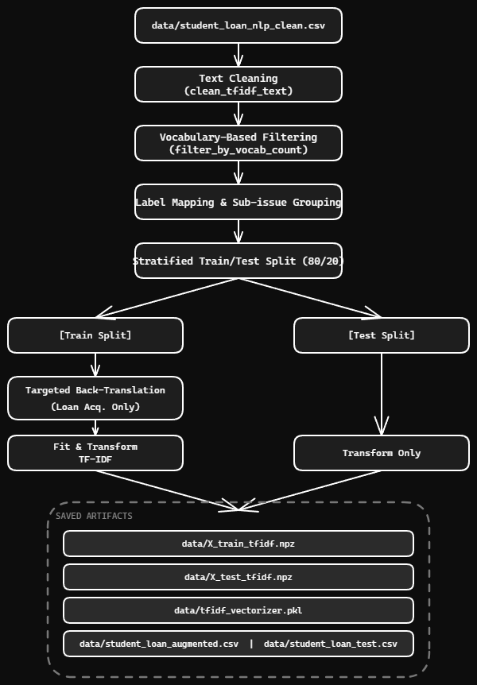

# Module Overview: Text Preprocessing & TF-IDF Vectorization

This module contains the text preprocessing, data augmentation, and feature extraction pipeline for processing student loan consumer complaints. The pipeline is designed to prepare raw textual narrative data for machine learning classification models using traditional TF-IDF vectorization.

---

## 1. File Descriptions

### `utils_NLP.py`
A utility module containing helper functions for text cleaning, data augmentation, label mapping, and vocabulary-based filtering.

* **`clean_tfidf_text(text)`**: Aggressive preprocessing specialized for TF-IDF vectorization. Handles lowercasing, URL removal, redaction marker removal (`XXXX`), number and punctuation stripping, stopword removal, single-character token filtering, and lemmatization using a noun-first/verb-fallback strategy to reduce vocabulary size and noise.
* **`back_translate(text, mid_lang)`**: Leverages the Google Translate API to translate text into an intermediate language (German) and back to English to generate paraphrased variations for data augmentation. Texts exceeding `BACK_TRANSLATE_MAX_CHARS` (5000 characters) are skipped entirely to avoid augmenting incomplete or truncated samples.
* **`back_translate_dataframe(df, ...)`**: Uses multithreading via `ThreadPoolExecutor` to execute back-translations concurrently across a pandas DataFrame. A per-row `time.sleep` delay is applied to space out requests across threads.
* **`get_issue_mapping()`**: Dictates the structural grouping of raw `Issue` labels into 4 broad semantic classes.
* **`filter_by_vocab_count(df, text_column, min_unique, max_unique)`**: Filters rows based on the number of unique tokens in the cleaned text. Removes entries with too few unique tokens (likely empty or junk text) and entries with too many unique tokens (likely data dumps or malformed entries). Applied before train/test split to avoid leakage. Returns the filtered DataFrame and a stats dictionary.
* **`get_subissue_mapping()`**: Returns the mapping dictionary for grouping `Sub-issue` labels into 4 semantic groups: `Payment & Repayment Issues`, `Loan Information & Servicing`, `Credit Reporting Issues`, and `Loan Acquisition & Eligibility`. Unmapped sub-issues are assigned to `'Other'`.

### `vectorizer.py`
The main execution script that controls the data preparation and vectorization workflow. It loads the dataset, cleans the text fields, applies vocabulary-based filtering, applies targeted data augmentation, splits the data, fits the TF-IDF vectorizer, and saves the final processed data splits and model artifacts.

---

## 2. Pipeline Logic & Methodology

### Text Preprocessing Logic
For TF-IDF, the script uses `clean_tfidf_text` to normalize tokens:
* **Noise Reduction**: Characters matching numbers, punctuation, and specific credit/loan content masking tokens (e.g., `XXXX`) are stripped away. Single-character tokens are also removed as they carry no semantic value.
* **Dimensionality Minimization**: Lemmatization via NLTK's `WordNetLemmatizer` uses a noun-first/verb-fallback strategy each token is first lemmatized as a noun, and if the form is unchanged, it is re-lemmatized as a verb. This ensures morphological variations (e.g., "payments" → "payment", "servicing" → "service") do not inflate the feature space with redundant near-duplicate terms, which would otherwise reduce the discriminative power of TF-IDF weights.

### Vocabulary-Based Filtering
After text cleaning and before the train/test split, rows are filtered based on unique token count:
* Rows with **fewer than 5 unique tokens** are removed as they are likely empty or junk entries after preprocessing.
* Rows with **more than 500 unique tokens** are removed as they are likely malformed data dumps.
* Filtering is applied before the split to prevent data leakage. Stats (rows removed, percentage kept, mean/median token counts) are printed for transparency.

### Label Engineering & Grouping
To combat extreme class sparsity and improve classification performance, data grouping logic is applied to target labels:
* **Issue Mapping**: Original complaints span numerous distinct issues. These are compressed into four semantic categories: `Loan Information & Servicing`, `Payment & Repayment Issues`, `Credit Reporting Issues`, and `Loan Acquisition & Eligibility`. Grouping at this level of granularity reflects genuine operational distinctions between complaint types each category maps to a different resolution pathway  while remaining coarse enough to maintain adequate per-class sample counts for reliable model training.
* **Sub-Issue Filtering**: unmapped sub-issues (not found in the mapping dictionary) are assigned to `Other` class to prevent high-variance errors in downstream models.

### Data Split & Augmentation Strategy
1. **Stratified Splitting**: The dataset is split into an 80/20 train/test ratio using stratification on the grouped `Issue` label. An 80/20 ratio was chosen as a standard balance between maximising the volume of training signal and retaining a test set large enough to produce statistically stable evaluation metrics across all four classes. Stratification is applied to preserve the natural class distribution in both splits, preventing the test set from being dominated by majority classes.
2. **Targeted Back-Translation**: To correct data imbalance, data augmentation via back-translation is isolated strictly to the minority class (`Loan Acquisition`) within the training split. **Augmentation is never applied to the test set** to ensure evaluation metrics remain untainted by synthetic data.
3. **Character Limit Skipping**: Texts exceeding 5000 characters are skipped entirely during back-translation (rather than truncated) to avoid generating augmented samples from incomplete narratives.
4. **ASCII Filtering**: Paraphrased strings containing non-ASCII characters are discarded to preserve uniform vocabulary tokenization.

### TF-IDF Configuration
The `TfidfVectorizer` transforms the normalized text into sparse matrices using the following hyperparameters:

* `max_features=50000`: Limits the vocabulary to the top 50,000 terms ranked by corpus-wide TF-IDF score. This ceiling is intentionally generous given the domain: consumer complaint narratives are verbose and lexically diverse, and an overly restrictive vocabulary would discard meaningful low-frequency domain terms (e.g., specific loan program names or regulatory references). At the same time, an uncapped vocabulary would introduce excessive noise and slow downstream model training without meaningful accuracy gains.

* `ngram_range=(1, 2)`: Captures both individual words (unigrams) and two-word phrases (bigrams). Bigrams are particularly valuable in this domain because complaint semantics are often phrase-dependent  "interest rate" and "payment plan" carry distinct meaning that unigrams alone cannot represent. Trigrams were excluded as they added feature-space dimensionality with marginal discriminative return at this corpus size.

* `min_df=3`: Terms appearing in fewer than 3 documents are discarded. This threshold filters out unique typos, rare proper nouns, and one-off complaint-specific references that would not generalise across unseen complaints, while still retaining low-frequency but meaningful domain terminology.

* `max_df=0.95`: Terms appearing in more than 95% of documents are treated as stopwords and discarded. In practice, this removes domain-specific filler words (e.g., "loan", "account") that are so pervasive across all complaint types that they carry negligible discriminative signal between classes.

* `sublinear_tf=True`: Applies logarithmic scaling to raw term frequencies (`1 + log(tf)`) rather than using the raw count. Consumer complaint narratives vary significantly in length; without this scaling, longer documents would systematically produce higher raw term counts, inflating their TF-IDF weights regardless of actual content relevance. Sublinear scaling dampens this length bias and produces more comparable feature vectors across complaints of different verbosity.

---

## 3. Data Flow Architecture

The data transitions through the following file paths and structures during execution:

