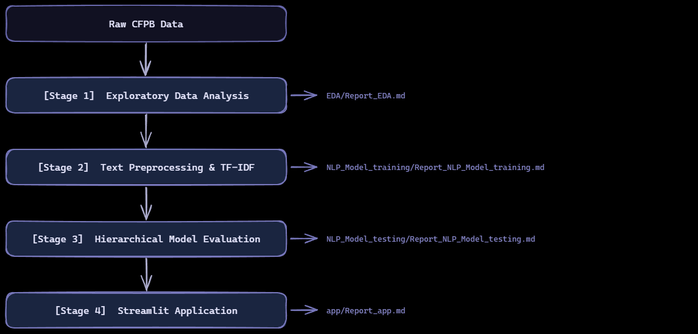

# ComplaintFlow

> **AI-powered complaint classification, human-backed.**

ComplaintFlow is a machine-learning system that automatically classifies consumer student loan complaints sourced from the Consumer Financial Protection Bureau (CFPB) into structured Issue and Sub-issue labels, eliminating the need for manual tagging. The system combines a hierarchical NLP classifier with a human review queue, exposed through a Streamlit dashboard that samples real, held-out CFPB complaints (2021-2022, outside the training window), runs them through the pipeline, and surfaces low-confidence or incorrect predictions for human correction.

---

## Pipeline Overview



---

## Stage 1: Exploratory Data Analysis

The raw dataset contains approximately 52,988 records and 16 features, covering CFPB complaints submitted between 2023 and early 2026. After filtering for records with a non-null complaint narrative, 25,603 usable samples remain. The dataset spans 12 unique Issues and 52 unique Sub-issues arranged in a natural hierarchy, with a heavily skewed distribution. The most common Issue accounts for over 30,000 complaints. A Cramér's V correlation analysis confirmed that all metadata columns (company, state, submission channel) score below 0.25 in association with the target labels, establishing the free-text narrative as the only feature with predictive value. A length-based filter drops complaints below the 25th percentile character count as a quality gate before export.

> For the full analysis including label distributions, compliance trends, and column pruning decisions → [`EDA/Report_EDA.md`](EDA/Report_EDA.md)

---

## Stage 2: Text Preprocessing & TF-IDF Vectorization

Raw narratives are passed through an aggressive cleaning pipeline: lowercasing, URL and redaction marker removal, number and punctuation stripping, stopword removal, and noun-first/verb-fallback lemmatization. Rows with fewer than 5 or more than 500 unique tokens after cleaning are filtered out before the train/test split. The original 52 Sub-issues are consolidated into 4 semantic groups to address extreme class sparsity. Back-translation via German is applied as a data augmentation strategy, strictly limited to the minority class (`Loan Acquisition & Eligibility`) within the training split to avoid test contamination. The TF-IDF vectorizer is configured with a 50,000-term vocabulary, unigrams and bigrams, `min_df=3`, `max_df=0.95`, and logarithmic TF scaling.

> For preprocessing logic, label engineering, augmentation strategy, and full vectorizer configuration → [`NLP_Model_training/Report_NLP_Model_training.md`](NLP_Model_training/Report_NLP_Model_training.md)

---

## Stage 3: Hierarchical Model Training & Evaluation

The classifier operates in two cascaded levels. Level 1 predicts one of two broad groups (`Loan Servicing & Payments` or `Non-Servicing Issues`); Level 2 predicts one of four sub-issues within the predicted group. Each level uses a soft-vote ensemble of Logistic Regression and a calibrated LinearSVC. To avoid leakage into the Level 2 training, Level 1 probabilities for the training set are computed via 5-fold out-of-fold cross-validation before being appended as cascade features. A joint confidence score `P(L1) × P(L2)` is computed for every prediction; complaints scoring below 0.45 are flagged for human review. The threshold was selected by sweeping from 0.30 to 0.85 and identifying the operating point that balances auto-labelled Macro F1 against human review rate. `model_evaluation.py` additionally validates a joint-perplexity uncertainty score against real ground-truth labels, and finds it unreliable for the single largest source of error (the `Loan Information & Servicing` ↔ `Payment & Repayment Issues` confusion, ~two-thirds of all sub-issue errors), where the model tends to be confidently wrong rather than genuinely uncertain. An exploratory baseline script (`hierarchical_baseline_experiment.py`) runs grid search and tests alternative groupings; the operational script (`model_evaluation.py`) locks in the final design and produces an evaluation dashboard.

> For model architecture, ensemble strategy, OOF cascading, threshold analysis, and evaluation dashboard → [`NLP_Model_testing/Report_NLP_Model_testing.md`](NLP_Model_testing/Report_NLP_Model_testing.md)

> See known limitations and future work in the linked report.

---

## Stage 4: Application Layer

The app is structured around three tabs: an Activity Log for sampling complaints and controlling the pipeline, a Results & Analysis dashboard with classification metrics and confusion matrices, and a Human Review Queue for correcting flagged predictions. Rather than generating complaints synthetically, the app samples real, held-out CFPB student loan complaints from 2021-2022, genuine narratives with genuine CFPB-assigned labels, sitting outside the 2023–early 2026 training window. No external API or key is required at runtime. The inference pipeline (`model_pipeline.py`) applies the same `clean_tfidf_text` function used during training to avoid training-serving skew, then runs the full L1 → L2 cascade. Complaints are additionally forced into review if either the Level 1 or Level 2 prediction is incorrect, regardless of confidence. Once a reviewer finalises decisions, human-reviewed rows are treated as correct and the Results tab recomputes all metrics accordingly.

> For file structure, inference pipeline details, review lifecycle, and setup instructions → [`app/Report_app.md`](app/Report_app.md)

---

## Tools & Technologies


---

## Installation & Usage

### 1. Clone & set up environment

```bash
git clone https://github.com/antonisraf/NLP-Tagging-Consumer-Complaints.git
cd NLP-Tagging-Consumer-Complaints
```

**Windows:**
```bash
python -m venv venv
venv\Scripts\activate
```

**Linux / macOS:**
```bash
python3 -m venv venv
source venv/bin/activate
```

```bash
pip install -r requirements.txt
```

### 2. Get the held-out evaluation data

Download the raw CFPB complaints export (Product = Student loan, filtered to 2021-2022) from [consumerfinance.gov](https://www.consumerfinance.gov/data-research/consumer-complaints/) and place it at `data/cfpb_2021-2022_holdout.csv`. No API key or `.env` file is needed.

### 3. Build artifacts & launch

```bash
# Build TF-IDF artifacts
python NLP_Model_training/vectorizer.py

# Train and save the model bundle
python app/train_and_save_models.py

# Launch the app
streamlit run app/streamlit_app.py
```
