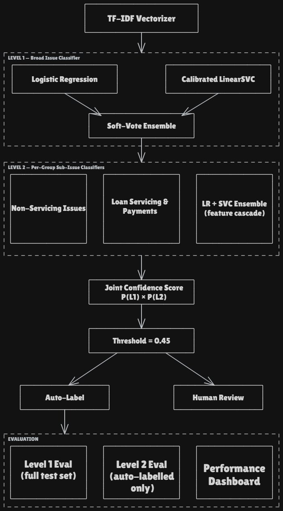
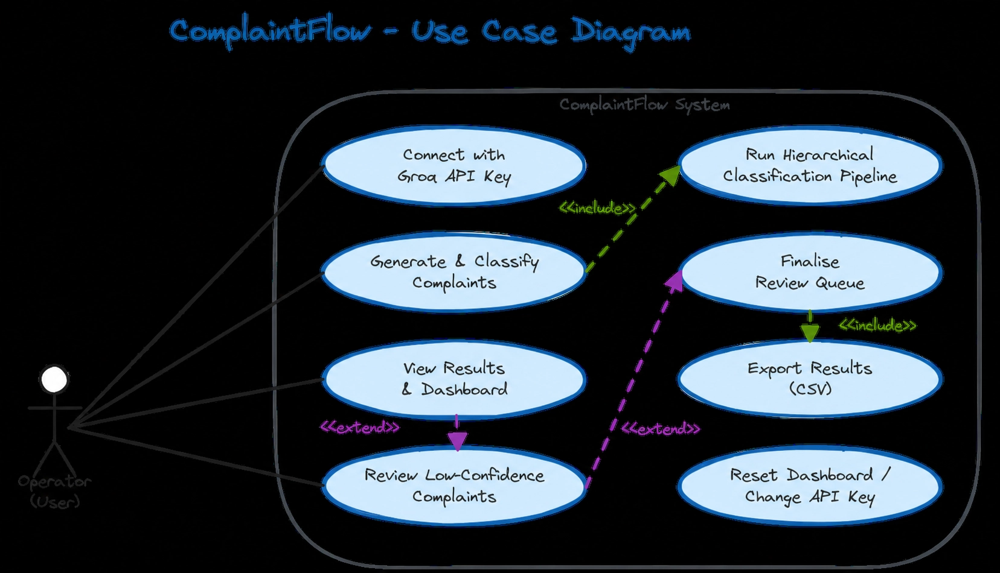

# ComplaintFlow `app/` Folder README

> **AI-powered complaint classification, human-backed.**

This directory contains the full application layer for **ComplaintFlow**, a Streamlit-based dashboard that generates synthetic student loan complaints, classifies them using a pre-trained hierarchical NLP pipeline, and routes low-confidence or incorrect predictions to a human review queue.

---

## Pipeline Overview



---

## Use Case Diagram



---

## Directory Structure

```
app/
├── streamlit_app.py          # Main Streamlit entry point
├── model_pipeline.py         # Inference wrapper (HierarchicalComplaintClassifier)
├── human_review_section.py   # Human Review Queue UI & logic
├── complaint_generator.py    # Synthetic complaint generation via Groq API
├── train_and_save_models.py  # One-time training script (run before first launch)
└── logo.png                  # Brand badge displayed in the app header
```

---

## File Reference

### `streamlit_app.py`
The main application entry point. Handles the full user-facing experience:

- **API Key Gate**  prompts the user for a Groq API key (`gsk_...` format) on first launch. The key is validated client-side, stored in session state, and never persisted.
- **Session Rate Limiting**  caps complaint generation at **5 runs per hour** per session to manage Groq API usage.
- **Three-Tab Layout**:
  - **Activity Log**  chat-style log showing the status of each pipeline run. Controls for the number of complaints (10–25) and the joint confidence threshold are also here.
  - **Results & Analysis** renders a dashboard with classification accuracy metrics, confusion matrices, and a per-complaint results table. After human review is finalised, the dashboard reflects the updated (human-corrected) labels.
  - **Human Review Queue**  delegates to `human_review_section.py`.
- **Sidebar**  shows API connection status, session run count, CSV download, and reset/key-change buttons.
- **Theming** dark-mode-only glass-morphism UI using CSS custom properties (Inter font, Slate/Indigo palette, radial gradient background).

**Key pipeline flow on "Generate & Classify":**
1. Calls `generate_synthetic_complaints()` to produce `n` labelled synthetic complaints via Groq.
2. Runs them through `HierarchicalComplaintClassifier.predict()`.
3. Compares predictions against the synthetic ground-truth labels.
4. Forces `needs_review = True` for any row where the broad issue (Level 1) was predicted incorrectly  on top of the model's own confidence-based flagging.
5. Stores the full results DataFrame in `st.session_state`.

---

### `model_pipeline.py`
Inference-only wrapper around the hierarchical two-level classifier. Loads two pre-trained artifacts from `data/`:

| Artifact | Description |
|---|---|
| `tfidf_vectorizer.pkl` | Fitted TF-IDF vectorizer (built by `vectorizer.py`) |
| `hierarchical_model_bundle.pkl` | Full model bundle (built by `train_and_save_models.py`) |

**`HierarchicalComplaintClassifier.predict(texts, threshold)`**

Runs the full cascade:
1. Cleans each text with `clean_tfidf_text()` (imported from `NLP_Model_training/utils_NLP.py`).
2. **Level 1 (broad issue):** Averages probabilities from a `LogisticRegression` and a calibrated `LinearSVC` to predict one of two broad groups: `Loan Servicing & Payments` or `Non-Servicing Issues`.
3. **Level 2 (sub-issue):** For each broad group, runs a separate pair of (LR + SVC) models whose feature matrix includes the Level-1 probability vector appended to the TF-IDF features (feature cascading). Predicts one of four sub-issues.
4. **Joint confidence** = Level-1 confidence × Level-2 confidence. Rows with joint confidence below `threshold` (default `0.45`) are flagged `needs_review = True`.

Returns a `pd.DataFrame` with columns: `complaint_text`, `cleaned_text`, `predicted_issue_broad`, `issue_confidence`, `predicted_subissue`, `subissue_confidence`, `joint_confidence`, `needs_review`, `joint_perplexity`.

**Joint Perplexity**

In addition to `joint_confidence`, `predict()` computes a Joint Perplexity score in the same inference pass, no extra model calls required. It measures the combined uncertainty of the pipeline across both levels, computed directly from the average probability distributions:

Joint Perplexity = e^(H(L1) + H(L2))

Where the entropy H for a probability distribution P is:

H(P) = −Σᵢ Pᵢ · log(Pᵢ + ε)

with ε = 10⁻¹⁰ added for numerical stability, to prevent log(0) errors.

Interpretation:

| Value | Meaning |
|---|---|
| ≈ 1.0 | Absolute certainty. The model assigned ~100% probability to a single broad issue and a single sub-issue. Text is clear and unambiguous. |
| ≈ 2.0 | Low/medium uncertainty. The model's confusion is equivalent to choosing between 2 equally likely scenarios. |
| ≥ 3.0 | High uncertainty. The model is split across 3 or more overlapping outcomes, typically complex, multi-topic, or poorly written complaints that likely require Human Review. |

Exposed in the Streamlit dashboard so reviewers can filter and prioritise the hardest cases, separately from the `needs_review` threshold flag.

**Known limitation — blind spot on near-duplicate categories**

Validated on the real labelled test set (not synthetic data), joint perplexity separates correct from incorrect predictions with an overall AUC-ROC of **0.648** (point-biserial r = 0.228). Breaking this down by error type shows the signal is not uniform:

| Error type | n | Mean perplexity | AUC vs. correct |
|---|---|---|---|
| Correct predictions | 2492 | 2.164 | — |
| `Loan Information & Servicing` ↔ `Payment & Repayment Issues` confusion | 911 | 2.292 | **0.601** |
| All other errors | 417 | 2.741 | **0.751** |

`Loan Information & Servicing` and `Payment & Repayment Issues` are near-duplicate categories that share vocabulary. This single pair accounts for roughly two-thirds of all sub-issue errors, and it is exactly where joint perplexity performs weakest (AUC 0.601, barely above chance). The model tends to be **confidently wrong** here rather than genuinely uncertain: the predicted probability distribution is sharp, just pointed at the wrong class, so entropy stays low even though the prediction is wrong.

By contrast, on rarer or more unusual errors outside this pair, perplexity works well (AUC 0.751) and is a reasonable uncertainty signal.

**Implication:** joint perplexity should not be used as the sole or primary routing signal for human review. It is a useful secondary diagnostic for surfacing atypical or multi-topic complaints, but it should not be trusted to catch the dominant Info/Payment confusion, which is currently still routed through the same joint-confidence threshold as everything else. No separate handling for this pair exists in the pipeline today.

---

### `human_review_section.py`
Renders the **Human Review Queue** tab and manages the review lifecycle.

**Taxonomy enforced:**

| Broad Issue | Sub-Issues |
|---|---|
| Loan Servicing & Payments | Loan Information & Servicing · Payment & Repayment Issues |
| Non-Servicing Issues | Credit Reporting Issues · Loan Acquisition & Eligibility |

**Review flow:**
- Displays only the rows where `needs_review = True`.
- Each complaint card shows the model's prediction, joint confidence, and a status badge (Pending / Decided).
- A reviewer picks a sub-issue from a flat dropdown of all 4 options; the broad issue is derived automatically via `SUBISSUE_TO_ISSUE` reverse lookup.
- Progress bar tracks how many complaints have been decided.
- **Finalise Reviews** is only enabled once all flagged complaints have a decision. Clicking it calls `apply_review_decisions()`, which writes `reviewed_issue`, `reviewed_subissue`, and `review_source` (`"human"` or `"model"`) back to the DataFrame.

**Accuracy treatment after finalisation:**
- Human-reviewed rows are marked `issue_correct = True` and `subissue_correct = True` the human takes ownership of those labels; they are not scored against the synthetic ground truth.
- Model-only rows retain their original accuracy verdicts.

After finalisation the Results tab reflects the updated labels and recomputes metrics accordingly.

---

### `complaint_generator.py`
Generates synthetic CFPB-style student loan complaints using **Groq's `llama-3.3-70b-versatile`** model.

**`generate_synthetic_complaints(n, api_key, topics, num_examples)`**

- Batches requests in groups of 10 to respect token limits.
- Each batch includes a few-shot block of real anonymised complaint narratives sampled from `data/student_loan_augmented.csv` (style reference only, not copied verbatim).
- The prompt instructs the model to distribute complaints evenly across all four sub-issues and respond with a strict JSON array of `{complaint_text, true_issue, true_subissue}` objects.
- Robust JSON extraction (`_extract_json_array`) handles cases where the model includes stray text outside the array brackets.

Returns a list of dicts, each with keys `complaint_text`, `true_issue`, and `true_subissue`.

---

### `train_and_save_models.py`
**One-time training script.** Run this once before launching the app to produce `data/hierarchical_model_bundle.pkl`.

**What it does:**
1. Loads pre-computed TF-IDF features (`X_train_tfidf.npz`) and the augmented training CSV.
2. Derives Level-1 labels from `Subissue_grouped` using the `GROUPING` dict.
3. Fits a `LogisticRegression` and a calibrated `LinearSVC` for Level 1 (broad issue).
4. Computes **out-of-fold Level-1 probabilities** via 5-fold cross-validation, which are then appended to the TF-IDF features as cascade inputs to Level-2 models (prevents leakage).
5. Fits separate LR + calibrated SVC models for each of the two broad groups at Level 2.
6. Serialises all models, class arrays, and the grouping map into a single `joblib` bundle.

**Usage:**
```bash
python app/train_and_save_models.py
```

**Output:** `data/hierarchical_model_bundle.pkl`

> The `GROUPING` dict here must remain in sync with the taxonomy in `complaint_generator.py` and `human_review_section.py`.

---

## Prerequisites & Setup

### Data files required (in `data/`)
| File | Built by |
|---|---|
| `student_loan_augmented.csv` | Provided / data pipeline |
| `tfidf_vectorizer.pkl` | `vectorizer.py` |
| `X_train_tfidf.npz` | `vectorizer.py` |
| `hierarchical_model_bundle.pkl` | `train_and_save_models.py` |


### First-time setup
```bash
# 1. Build the TF-IDF vectorizer (if not already done)
python NLP_Model_training/vectorizer.py

# 2. Train and save the hierarchical model bundle
python app/train_and_save_models.py

# 3. Launch the app
streamlit run app/streamlit_app.py
```

---

## Notes

- The app requires a **Groq API key** at runtime for synthetic complaint generation. Get one free at [console.groq.com](https://console.groq.com). The key is session-scoped and never written to disk.
- All classification logic is **inference-only** at runtime; no retraining happens when the app is running.
- Human review decisions override model predictions and are propagated to the Results tab as soon as the reviewer clicks **Finalise Reviews**.